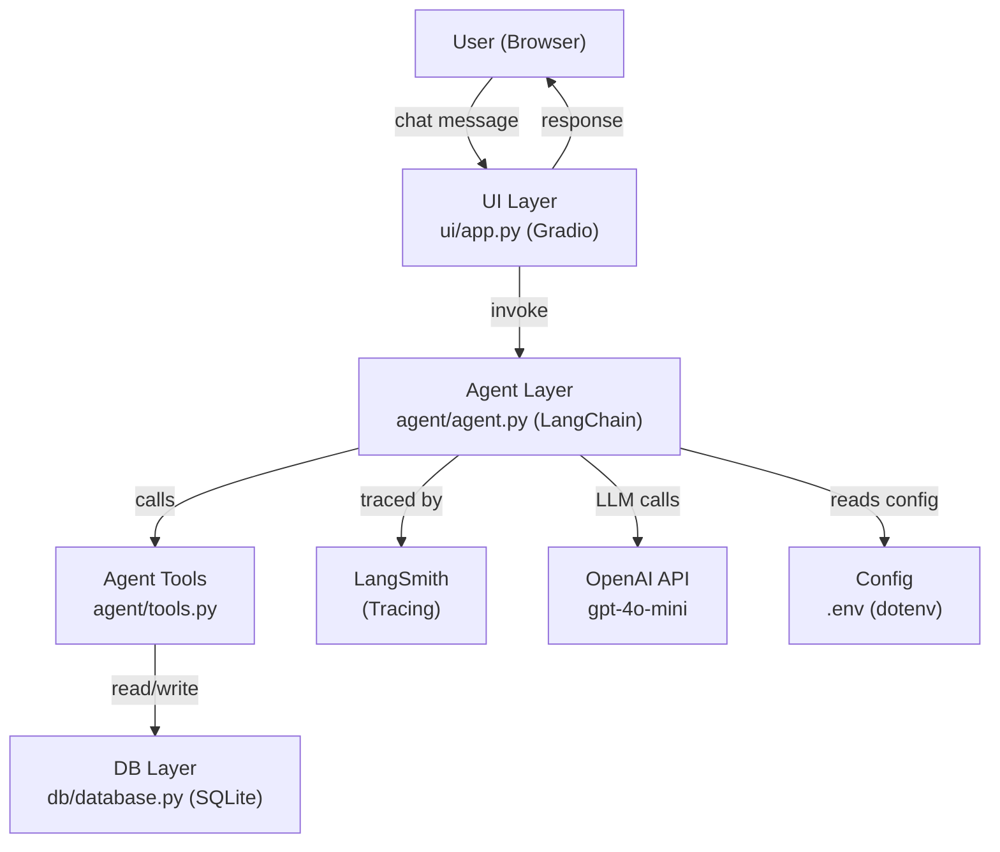
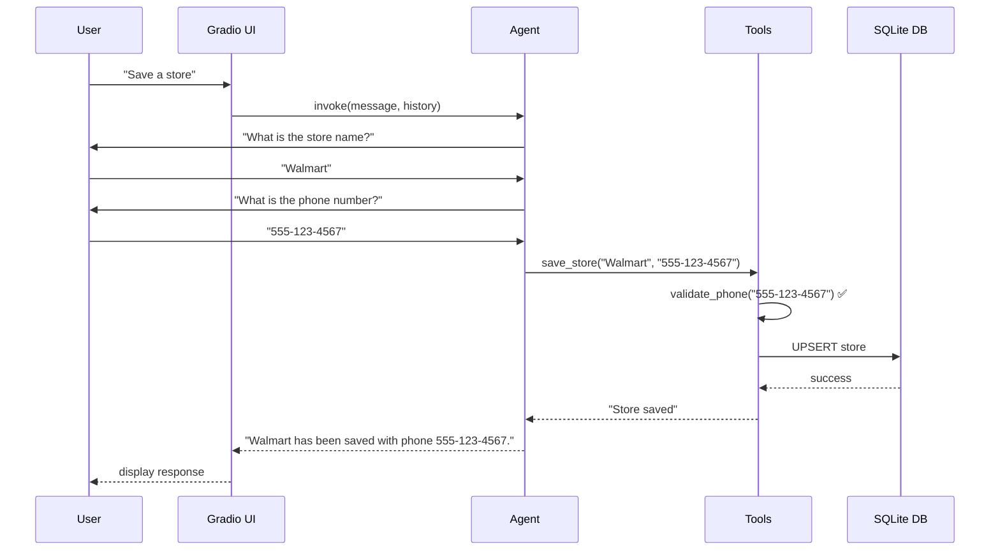
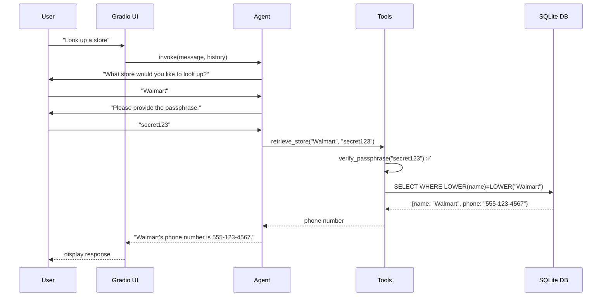

# Detailed Design — Store Assistant

## Overview

Store Assistant is a conversational LLM-based agent built with LangChain and OpenAI `gpt-4o-mini` that allows users to save and retrieve store records (name + phone) from a SQLite database. The agent validates phone numbers, gates lookups behind a passphrase, supports unlimited save/retrieve operations per session, terminates gracefully on user intent or repeated off-topic messages, and saves a rich conversation summary at session end. A Gradio web UI provides the demo interface, and LangSmith traces all LLM calls.

---

## Detailed Requirements

### Functional Requirements

#### Store Save
- FR-01: Agent SHALL prompt the user for store name and phone number when they express intent to save a store.
- FR-02: Agent SHALL validate the phone number as a US format before saving.
  - Valid formats: `(555) 555-5555`, `555-555-5555`, `5555555555`, `+15555555555`
- FR-03: Agent SHALL re-prompt for the phone number if the format is invalid, explaining the expected format.
- FR-04: On valid input, agent SHALL upsert the store record (insert or update phone if name already exists, case-insensitive).
- FR-05: Agent SHALL confirm successful save to the user.

#### Store Retrieve
- FR-06: Agent SHALL prompt for the store name when the user expresses intent to look up a store.
- FR-07: Agent SHALL request the secret passphrase before performing the lookup.
- FR-08: Agent SHALL allow up to 3 passphrase attempts. On failure after 3 attempts, the lookup is dropped and the agent informs the user.
- FR-09: On correct passphrase, agent SHALL perform a case-insensitive lookup and return the store's phone number.
- FR-10: If the store is not found, agent SHALL inform the user.

#### Session Management
- FR-11: Users MAY perform save and retrieve operations in any order, any number of times per session.
- FR-12: Agent SHALL terminate the conversation when the user says "I'm done", "I'm good", or similar farewell utterances.
- FR-13: Agent SHALL terminate the conversation after 3 consecutive off-topic user messages, warning the user after each one.
- FR-14: On termination (any cause), agent SHALL generate a rich conversation summary and save it to the database.

#### Conversation Summary
- FR-15: Summary SHALL include:
  - Narrative text describing what happened in the session
  - Timestamp (session start and end)
  - Count of stores saved
  - Count of stores retrieved
  - Session duration in seconds

### Non-Functional Requirements
- NFR-01: All LLM calls SHALL be traced via LangSmith.
- NFR-02: OpenAI API key SHALL be loaded from `.env`, never hardcoded.
- NFR-03: LangSmith API key SHALL be loaded from `.env`.
- NFR-04: Secret passphrase SHALL be loaded from `.env` (`STORE_LOOKUP_PASSPHRASE`).
- NFR-05: The application SHALL run locally using `pipenv` with Python 3.10.17.
- NFR-06: Test suite SHALL cover at least 5 areas: phone validation, DB layer, passphrase gating, agent conversation flow, off-topic termination.

---

## Architecture Overview



### Data Flow — Save Store


### Data Flow — Retrieve Store


---

## Components and Interfaces

### `store_assistant/` — Project Root Package

```
store_assistant/
├── agent/
│   ├── __init__.py
│   ├── agent.py          # LangChain agent setup, conversation loop logic
│   ├── tools.py          # LangChain tools: save_store, retrieve_store
│   └── prompts.py        # System prompt and prompt templates
├── db/
│   ├── __init__.py
│   └── database.py       # SQLite connection, schema, CRUD operations
├── ui/
│   ├── __init__.py
│   └── app.py            # Gradio chat interface
├── config.py             # Loads and exposes .env variables
└── tests/
    ├── __init__.py
    ├── test_phone_validation.py
    ├── test_database.py
    ├── test_passphrase.py
    ├── test_agent_flow.py
    └── test_offtopic_termination.py
```

### `config.py`
```python
# Loads from .env:
OPENAI_API_KEY: str
LANGCHAIN_API_KEY: str
LANGCHAIN_TRACING_V2: str = "true"
LANGCHAIN_PROJECT: str = "store-assistant"
STORE_LOOKUP_PASSPHRASE: str
```

### `db/database.py`

**Schema:**

```sql
CREATE TABLE IF NOT EXISTS stores (
    id INTEGER PRIMARY KEY AUTOINCREMENT,
    name TEXT NOT NULL UNIQUE COLLATE NOCASE,
    phone TEXT NOT NULL,
    created_at TIMESTAMP DEFAULT CURRENT_TIMESTAMP,
    updated_at TIMESTAMP DEFAULT CURRENT_TIMESTAMP
);

CREATE TABLE IF NOT EXISTS conversation_summaries (
    id INTEGER PRIMARY KEY AUTOINCREMENT,
    session_id TEXT NOT NULL,
    summary_text TEXT NOT NULL,
    stores_saved INTEGER DEFAULT 0,
    stores_retrieved INTEGER DEFAULT 0,
    session_start TIMESTAMP NOT NULL,
    session_end TIMESTAMP NOT NULL,
    duration_seconds REAL NOT NULL,
    created_at TIMESTAMP DEFAULT CURRENT_TIMESTAMP
);
```

**Public Interface:**
```python
def init_db(db_path: str) -> None
def upsert_store(name: str, phone: str) -> None
def get_store(name: str) -> dict | None          # case-insensitive lookup
def save_summary(session_id, summary_text, stores_saved, stores_retrieved, session_start, session_end) -> None
```

### `agent/tools.py`

Two LangChain tools exposed to the agent:

| Tool | Description | Args | Returns |
|------|-------------|------|---------|
| `save_store` | Validates phone and upserts store to DB | `name: str`, `phone: str` | Success/error message |
| `retrieve_store` | Verifies passphrase and fetches store | `name: str`, `passphrase: str` | Phone number or error message |

### `agent/agent.py`

**Responsibilities:**
- Initialize LangChain `ChatOpenAI` with `gpt-4o-mini`
- Bind tools to the agent via `create_tool_calling_agent`
- Maintain `ConversationBufferMemory` for multi-turn history
- Track session state: `off_topic_count`, `stores_saved_count`, `stores_retrieved_count`, `session_start`
- Detect termination conditions (farewell intent, 3 off-topic strikes)
- On termination: generate summary via LLM, call `db.save_summary()`
- Expose `chat(user_message: str, history: list) -> tuple[str, list]` for Gradio

**System Prompt (summary):**
- Agent is a store directory assistant
- It can save stores (name + phone) and look up stores (requires passphrase)
- It must validate phone numbers and reprompt on invalid input
- It must warn on off-topic messages and terminate after 3 consecutive ones
- It must recognize farewell utterances and terminate gracefully
- It must never reveal the passphrase

### `ui/app.py`

- Gradio `gr.ChatInterface` wrapping `agent.chat()`
- Single-session stateful chat
- Launch on `localhost:7860`

---

## Data Models

### Store Record
```python
@dataclass
class Store:
    id: int
    name: str           # stored as-is, queried case-insensitively
    phone: str          # normalized US format
    created_at: datetime
    updated_at: datetime
```

### Conversation Summary Record
```python
@dataclass
class ConversationSummary:
    id: int
    session_id: str         # uuid4
    summary_text: str       # LLM-generated narrative
    stores_saved: int
    stores_retrieved: int
    session_start: datetime
    session_end: datetime
    duration_seconds: float
```

---

## Error Handling

| Scenario | Handling |
|----------|----------|
| Invalid phone format | Agent reprompts with format hint, does not save |
| Wrong passphrase (attempt 1-2) | Agent informs user and asks to try again |
| Wrong passphrase (attempt 3) | Agent drops the request, informs user |
| Store not found | Agent informs user the store doesn't exist |
| DB connection error | Log error, return friendly message to user |
| OpenAI API error | Catch exception, return friendly retry message |
| LangSmith unavailable | Log warning, continue without tracing (non-blocking) |

---

## Testing Strategy

All tests use `pytest`. DB tests use a temporary in-memory SQLite instance. Agent flow tests mock the LLM to avoid live API calls.

| Test File | Coverage Area | Key Cases |
|-----------|---------------|-----------|
| `test_phone_validation.py` | US phone regex | Valid: `555-555-5555`, `(555) 555-5555`, `5555555555`, `+15555555555`; Invalid: `123`, `abc`, `12345678901234` |
| `test_database.py` | DB CRUD | Insert store, upsert (update phone), case-insensitive get, not-found, save summary |
| `test_passphrase.py` | Passphrase gating | Correct passphrase allows lookup; wrong passphrase blocks; 3rd failure drops request |
| `test_agent_flow.py` | End-to-end conversation | Save store turn, retrieve store turn, summary generation on termination |
| `test_offtopic_termination.py` | Off-topic logic | Warning after 1st/2nd off-topic; termination after 3rd; reset counter on in-scope message |

---

## Appendices

### A. Technology Choices

| Component | Choice | Rationale |
|-----------|--------|-----------|
| LLM Framework | LangChain | Mature tool-calling support, native LangSmith integration |
| LLM | OpenAI `gpt-4o-mini` | Fast, cost-efficient, strong instruction following |
| Database | SQLite | Zero-config, file-based, no server, fits scope |
| Tracing | LangSmith | Native LangChain integration, minimal setup, free tier |
| UI | Gradio | Minimal code for a functional chat UI, runs locally |
| Python Env | pipenv + Python 3.10.17 | Per project requirement |

### B. Key Constraints
- Single-user, single-session (no auth, no multi-tenancy)
- Local execution only
- No web deployment required
- Passphrase is fixed per env config (not per user)
- Phone validation is US-only

### C. Alternative Approaches Considered
- **PydanticAI** — strong typing but less mature tool ecosystem vs LangChain
- **PostgreSQL** — over-engineered for local single-user scope
- **Streamlit** — slightly more overhead than Gradio for pure chat
- **Arize Phoenix** — good local option but LangSmith is more natural with LangChain
